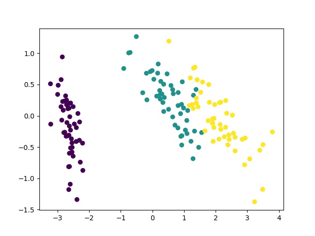
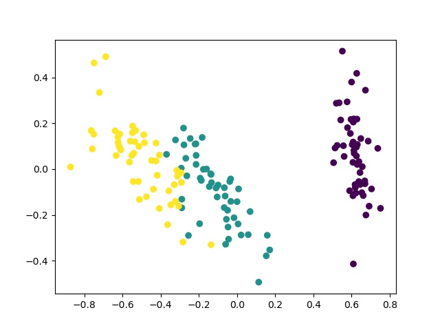
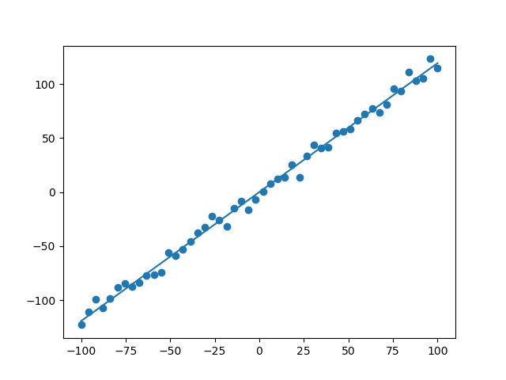
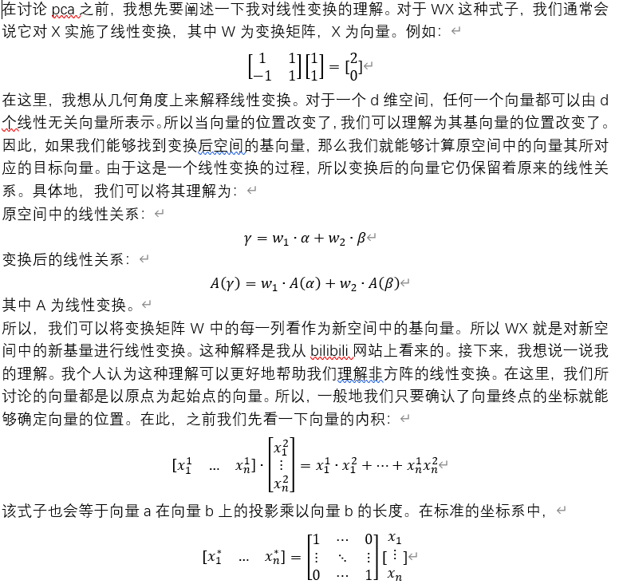
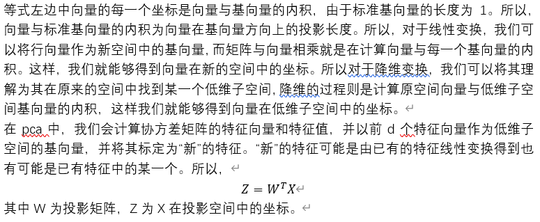

# dimension-reduction
在这里，我实现了pca和mds两种不同的降维算法。同时，使用两种降维方法将鸢尾花数据集的特征数降低为2，并可视化。
# Environment
python 3.7  
pytorch 1.5  
torchvision 0.6  
opencv 3.4
# Experiment
鸢尾花数据集的可视化结果如下所示，前者为pca算法的可视化结果，后者为mds算法的可视化结果。  
  
  
两种算法对鸢尾花数据集降维后的结果相似，不过mds找到了一个与pca想法的子空间。  
pca算法能够找到数据的主成分，对于一维线性相关数据，我们能够利用pca来找到两者之间的映射关系呢？所以，我额外进行了另外一个实验，使用pca求解一维线性相关数据的关系。在这里，我们只需要找到数据的第一个主要成分，该成分对应的特征向量即为一维数据之间的映射关系，结果如下所示：  
  
该结果与regression项目中所求解的线性回归结果一致。
# 附录
word文档中的内容为我对线性变换和pca的理解：  
  

